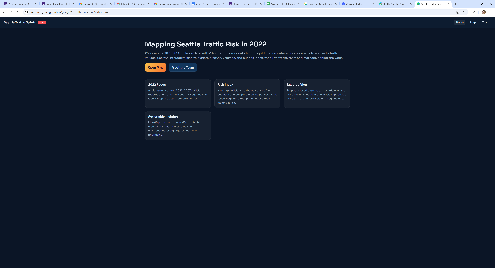
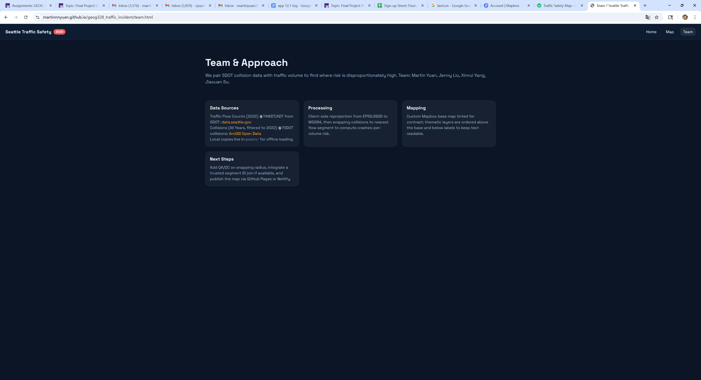

# Seattle High-Risk Corridors: Crashes & Volume (2022)

**Group AD1:**
-   **Martin Yuan**
-   **Jenny Liu**
-   **Jiaxuan Su**
-   **Xinrui Yang**

## Project Description

Our project is an interactive web GIS that blends SDOT’s 2022 collision records with 2022 traffic flow counts to surface high risk corridors across Seattle. Users can toggle collision points, traffic volume lines scaled by AWDT/ADT, and a computed risk index that snaps crashes to the nearest flow segments to highlight crashes per volume hot spots. Feature popups and a ranked risk list provide detail, while reprojection from EPSG:2926 to WGS84 and client side turf.js keep everything running in the browser. Data comes from SDOT Traffic Flow Counts 2022 (AWDT/ADT) and SDOT Collisions (all years, filtered to 2022), cached in assets folder for fast loading, and the map is built with MapLibre GL, turf.js.

## Favicon

The favicon shows a cute white car driving across a blue and green circular background, which represents the city and its road network in a friendly, playful way. The soft gradient colours make it feel light and modern, rather than serious or stressful. Next to the car, there is a small pink location pin with a tiny exclamation mark inside, symbolising traffic incidents or points of interest that the map is highlighting. Together, the car and the pin communicate that this is a web GIS about traffic and safety, but the rounded shapes and bright colours keep the mood positive and approachable, inviting users to explore the map rather than feel worried about accidents.

## Project Goal

Our project aims to make Seattle’s traffic safety patterns easy to understand and use. By combining traffic volume and crash count data, we identify areas where crashes happen more often than expected, especially where traffic is not very heavy but accidents are still frequent—places that may have issues in road design, signage, or maintenance. Through an interactive web map, we want everyday drivers to stay aware of high-risk areas and drive more carefully, while also giving traffic safety researchers and government agencies a clear visual tool to locate accident-prone zones, prioritize safety interventions, and plan infrastructure improvements that can help prevent future crashes.

## Application URL

https://martinnnyuan.github.io/geog328_traffic_incident/index.html

## Screenshots

## Main Functions
-   Show 2022 collision points with severity aware styling and popups for date, type, and weather details.
-   Display 2022 traffic flow segments with colors scaled by AWDT.
-   Compute and visualize a risk index (crashes per volume) by snapping collisions to the nearest flow segment; toggle the layer and view to a top risk list with zoom in by clicking.
-   Layer controls, popups, and legend to help compare collisions, volume, and risk hotspots.

## Data Sources
The map uses two 2022 SDOT datasets: traffic flow counts (AWDT/ADT) from the Seattle open data portal (“2022 Traffic Flow Counts”) and SDOT’s citywide collisions (“SDOT Collisions, All Years,” filtered to 2022). Both source files are published in EPSG:2926 (NAD83(HARN) / Washington North, US ft) and are reprojected client-side to WGS84 for display; flow segments drive volume symbology, and collision points carry severity, date, and context fields used in popups and the risk index.

## Applied Libraries and Web Service
-   Applied libraries
    -    The app runs fully in the browser with MapLibre GL (open-source Mapbox GL JS–compatible rendering).
    -    Turf.js for spatial ops (nearestPointOnLine, bbox).
    -    Proj4 for client-side reprojection from EPSG:2926 to WGS84.
-   Web Services
    -    Basemap tiles come from Carto’s light raster set (built on OpenStreetMap).
    -    The web is hosted as static files through GitHub Pages, all related assets are stored online through GitHub for design and teamwork. 

## Acknowledgements
We thank the help and suggestion from Professor Zhao and TA Alex. 

We also thank SDOT and the City of Seattle for open access to the 2022 Traffic Flow Counts and SDOT Collisions datasets, the OpenStreetMap and Carto communities for the basemap tiles, and the maintainers of MapLibre GL, turf.js, and proj4 for the open source tools that power this web map.

## AI Use Disclosure
We used CodeX in ChatGPT for the assistance of our website desgin. CodeX helped us with the build up of the structure of the web, improvements of the design style, and also some debug works. 

